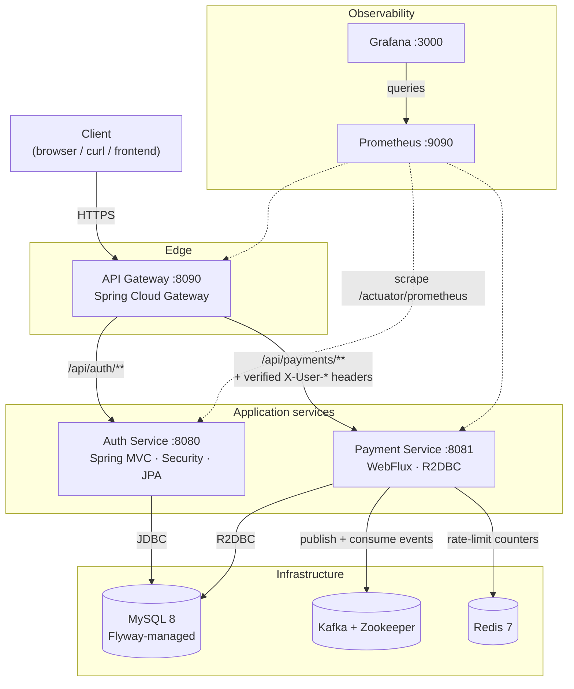
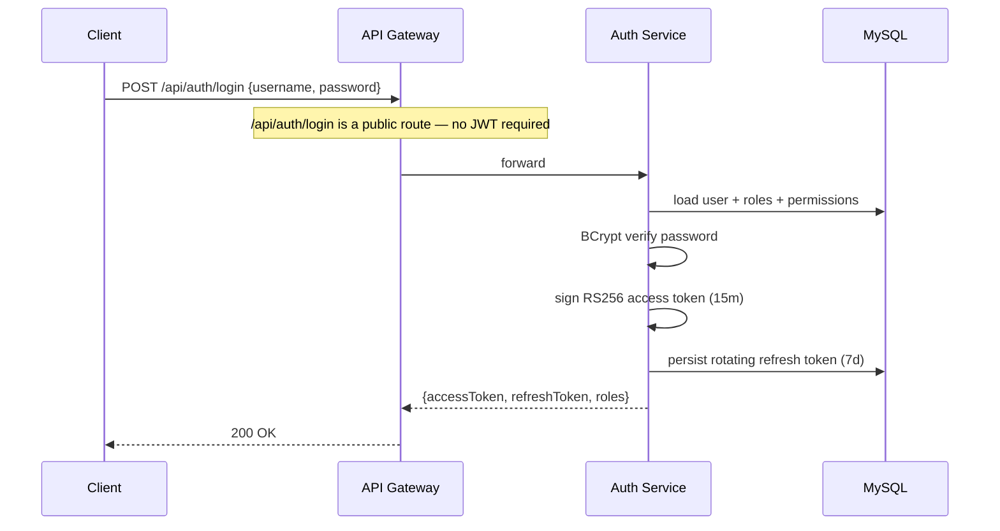
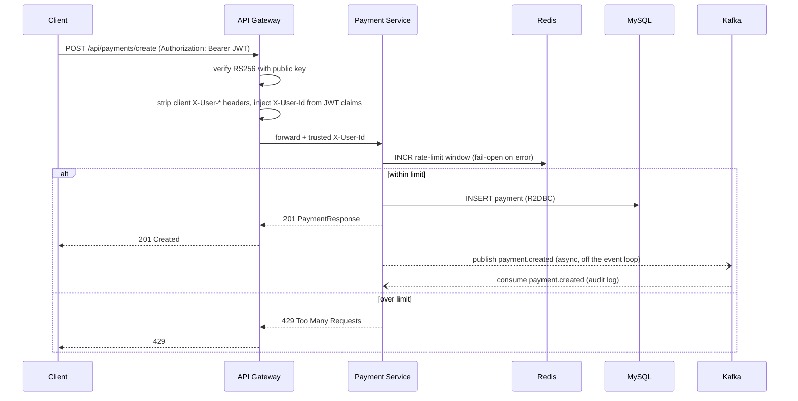
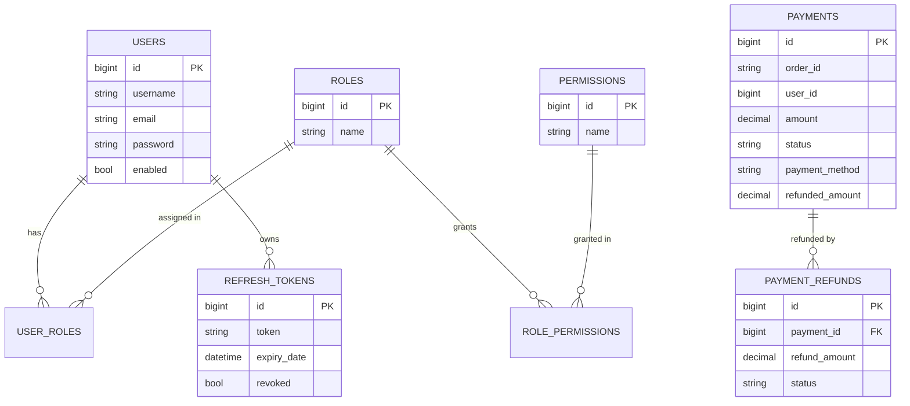
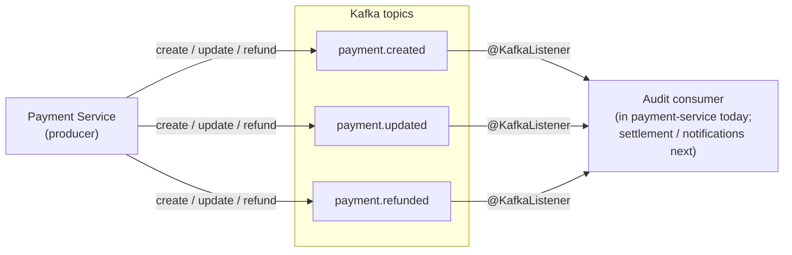
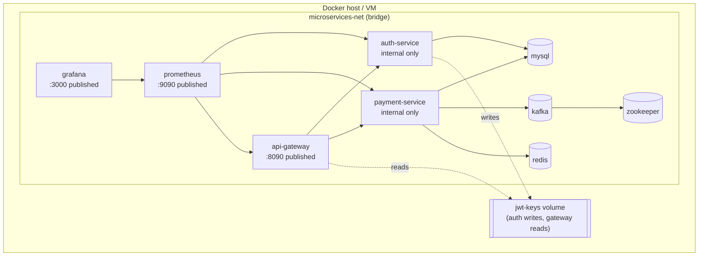
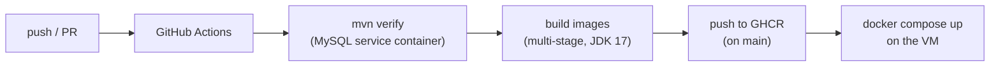

# Architecture

This document explains **what the system is, what every technology is used for, and how the
pieces interact**. All diagrams are Mermaid and render directly on GitHub.

---

## 1. System overview

A small but production-shaped payment platform built as independent Spring Boot services
behind a single API gateway, with event streaming, caching/rate-limiting, and a metrics stack.

**Why this shape**

- The **gateway** is the only entry point — it authenticates requests once at the edge and
  forwards a trusted identity, so downstream services stay simple.
- **Auth** is a classic blocking stack (JPA) because identity data is relational and low-volume.
- **Payment** is **reactive** (WebFlux/R2DBC) because payment traffic is the hot path and
  benefits from non-blocking I/O and backpressure.
- **Kafka** decouples side effects (settlement, notifications, audit) from the request path.
- **Redis** provides fast, shared rate-limit state across payment instances.

---

## 2. Technology stack — what each piece does and how it is used

| Technology | Where | What it is used for / how |
|---|---|---|
| **Java 17, Spring Boot 3.1.5** | all services | Base runtime and DI/auto-config. |
| **Maven (multi-module)** | repo | One reactor: `common`, `auth-service`, `payment-service`, `api-gateway`. |
| **Lombok** | all | Boilerplate (`@Data`, `@Builder`); pinned + declared on the annotation-processor path for JDK 23+. |
| **Spring MVC** | auth | Blocking REST controllers. |
| **Spring WebFlux + Netty** | payment, gateway | Non-blocking reactive HTTP. |
| **Spring Security** | auth | Authentication provider, `BCrypt`, method security, stateless filter chain. |
| **JJWT (`io.jsonwebtoken`)** | auth, gateway | Sign (auth) and verify (gateway) **RS256** JWTs. |
| **RSA keypair** | auth → gateway | Auth signs with the private key; gateway verifies with the public key. Generated on first start and shared via a Docker volume. |
| **Spring Data JPA / Hibernate** | auth | Relational mapping for users/roles/permissions. |
| **Spring Data R2DBC** (`io.asyncer:r2dbc-mysql`) | payment | Reactive DB access; custom converters store enums as `VARCHAR`. |
| **Flyway** | auth, payment | Versioned SQL migrations own the schema (`ddl-auto: none`); separate history tables share one DB. |
| **MySQL 8** | both | Primary datastore. |
| **Spring Kafka** | payment | Publish `payment.created/updated/refunded`; a consumer logs/audits them. Publishing is offloaded so a broker outage never blocks a request. |
| **Spring Data Redis Reactive (Lettuce)** | payment | Fixed-window rate-limit counters; **fails open** if Redis is down. |
| **Spring Cloud Gateway** | gateway | Routing, CORS, and a global JWT/identity filter. |
| **Micrometer + Prometheus** | all | `/actuator/prometheus` metrics endpoint. |
| **Prometheus / Grafana** | monitoring | Scrape + dashboards (provisioned datasource + "Microservices Overview"). |
| **Spring Boot Actuator** | all | Health, info, metrics; `liveness`/`readiness` probe groups. |
| **Logback + logstash-encoder** | common | Human-readable logs in dev, **single-line JSON** in the `prod` profile. |
| **Docker (multi-stage) + Compose** | deploy | Build each service with JDK 17 inside the image; one compose file runs the whole stack. |
| **GitHub Actions** | CI | Build + test against a MySQL service, then build/push images to GHCR on `main`. |

---

## 3. The `common` module

Shared library depended on by every service so contracts stay consistent:

- `dto/ApiResponse`, `dto/ErrorResponse` — uniform success/error envelopes.
- `exception/ResourceNotFoundException`, `BusinessException` — mapped to HTTP status by each service's `@RestControllerAdvice`.
- `constant/Constants` — the propagation header names (`X-User-Id`, …), Kafka topic names, and role names, so producers/consumers and the gateway/services agree.
- `logback-spring.xml` — the shared logging policy.

---

## 4. Request flows

### 4.1 Login (token issuance)

### 4.2 Create payment (authenticated, event-driven)

**Key security property:** the gateway always removes any client-supplied `X-User-*` headers
and re-injects them from the verified token, so a caller cannot spoof another user's identity.

---

## 5. Data model

- **Auth schema** (`V1__auth_schema.sql`): users/roles/permissions with join tables and refresh tokens. Roles and permissions are seeded; the admin user is bootstrapped on first run.
- **Payment schema** (`V1__payment_schema.sql`): payments + refunds, with optimistic-locking `version` and indexed `user_id`/`status`/`order_id`.

---

## 6. Event-driven flow

Publishing is **best-effort and non-blocking**: the send runs on a worker thread with a short
`max.block.ms`, so a Kafka outage logs an error but never fails or slows the payment request.

---

## 7. Deployment topology (Docker Compose)

- Only **gateway**, **Prometheus**, and **Grafana** publish host ports; application services are
  reachable only inside the Docker network (enforcing "everything goes through the gateway").
- Auth and gateway share the RSA keys through the `jwt-keys` volume.
- Published ports are env-overridable (`GATEWAY_PORT`, `PROMETHEUS_PORT`, `GRAFANA_PORT`).

See [DEPLOYMENT.md](DEPLOYMENT.md) for VM setup steps and [README.md](README.md) for quick start.

---

## 8. Build & CI/CD

Each service image is a multi-stage build: Maven compiles the module (and `common`) with a
JDK-17 toolchain, then the jar is copied onto a slim JRE image that runs as a non-root user.
